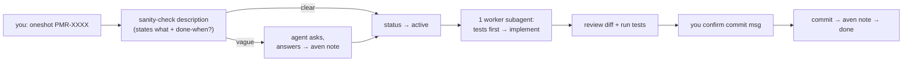
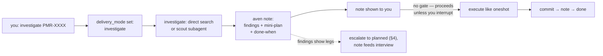
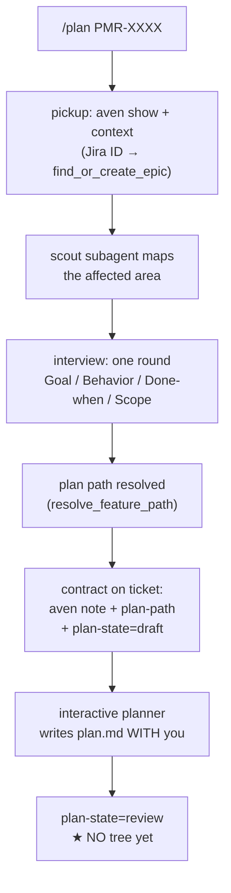
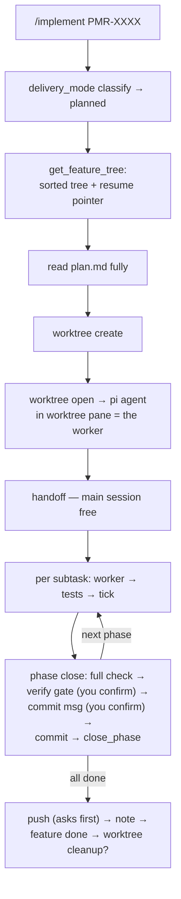
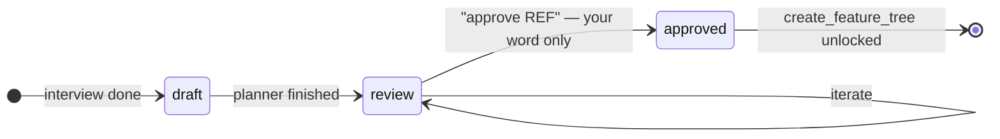
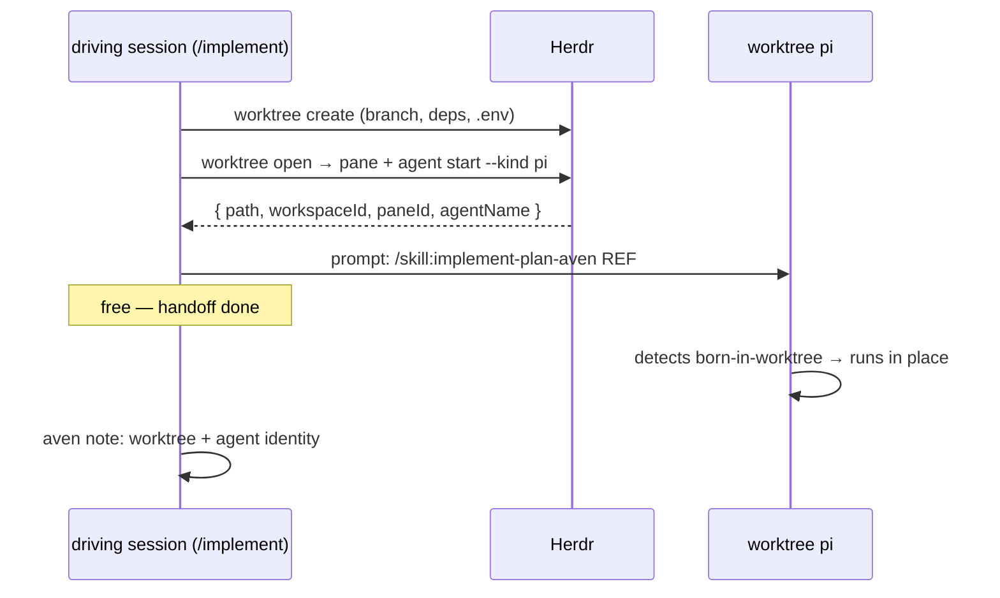

# Aven feature flow: plan → implement

How to take work from "I want something built" to "done" with aven + pi.
Pick your situation below — each section says **what you type** and **what
happens next**.

- [I have no ticket yet](#1-no-ticket-yet)
- [Ticket exists, it's small — just do it](#2-oneshot--the-ticket-is-the-spec)
- [Ticket exists, needs a codebase look first](#3-investigate--mini-plan-as-an-aven-note)
- [Ticket exists, needs a real plan](#4-planned--spec--tree--phased-execution)
- [Resuming later](#5-resuming)
- [Where things live](#6-where-things-live)
- [States and gates](#7-states-and-gates)
- [Worktree sessions](#8-worktree-sessions-push-handoff)
- [Tool reference](#9-tool-reference)
- [Jira-linked work](#10-jira-linked-work)

Source skills: `skills/engineering/feature-plan-aven/SKILL.md` (planning),
`skills/engineering/implement-plan-aven/SKILL.md` (execution). The mechanics
live in tools (`pi-planning` aven-tools, `pi-worktree`); the skills carry the
judgment.

---

## 1. No ticket yet

```bash
aven add "Add dark mode to settings page"     # lands in inbox
```

Or just tell pi: *"ticket: add dark mode to settings page"* — the agent
creates it. For a Jira ticket instead, see [§10](#10-jira-linked-work).

Not sure the ticket is even worth creating? `/skill:explore` first — chat
Q&A about the codebase, no aven state until you say "ticket it" or "plan it".

Then decide the tier (next three sections). Rule of thumb:

```text
Description already says WHAT + DONE-WHEN?      → oneshot
Clear WHAT, unclear WHERE/HOW deep?             → investigate
Multi-step, design choices, >1 commit?          → planned
```

## 2. Oneshot — the ticket is the spec

**Trigger:** `oneshot PMR-XXXX` (or `/implement PMR-XXXX` on a plan-less
ticket and confirm the oneshot route).

**Flow:**



No plan.md, no tree, no extra tickets. If the work balloons past one commit,
the agent stops and routes to [§4](#4-planned--spec--tree--phased-execution).

## 3. Investigate — mini-plan as an aven note

**Trigger:** `/plan PMR-XXXX` and during triage pick **investigate** — or
say *"spike PMR-XXXX"* / *"investigate then do PMR-XXXX"*. The ticket gets
`delivery-mode=investigate`.

**Flow:**



The note is the spec — durable, resumable, visible in the aven TUI. Still
no plan.md, no extra tickets.

## 4. Planned — spec + tree + phased execution

**Trigger:** `/plan PMR-XXXX` (or `/plan DP-71` for Jira), then pick
**planned** at triage. Ticket gets `delivery-mode=planned`.

Two stages, gated:

### Stage 1 — author the plan



You review plan.md (opens in a review pane), iterate with the planner if
needed. When satisfied: **`approve PMR-XXXX`** — your word, only yours,
flips `plan-state=approved`.

### Stage 2 — create the tree

`create_feature_tree` turns plan.md into aven tickets — and **refuses**
unless `plan-state=approved` (gate enforced in code, zero writes otherwise):

```text
PMR-XXXX  (epic)  metadata: plan-path, plan-state=approved, delivery-mode=planned
  ├── "1. Phase: …"   labels=[phase,impl]  ← dep: none
  │     └── "1.1 …"   labels=[impl]        ← dep: phase 1
  └── "2. Phase: …"   labels=[phase,impl]  ← dep: phase 1 (order guarantee)
        └── "2.1 …"   labels=[impl]        ← dep: phase 2
```

Every ticket carries its own `plan-path` + a self-contained description
(implementation summary + acceptance criteria lifted from plan.md), so a
worker never needs to open plan.md. Phase deps mean
`aven list --ready` shows exactly one phase at a time.

### Execution

**Trigger:** `/implement PMR-XXXX`.



## 5. Resuming

Everything needed lives on the tickets — any later session picks up:

| You say | What happens |
|---|---|
| `/plan PMR-XXXX` again | branches on `plan-state`: draft → finish plan; review → iterate; approved → create tree |
| `/implement PMR-XXXX` again | `get_feature_tree` → first non-done item = resume pointer; `worktree:` note locates the workspace |
| nothing | `aven list --metadata plan-state=review --open` = plans awaiting you; `aven list --has-metadata plan-path --open` = executable features |

Done work is trusted unless codebase evidence contradicts it.

## 6. Where things live

| What | Where | Written by |
|---|---|---|
| Tickets, tree, statuses, notes | aven's local SQLite DB (workspace-scoped; `aven doctor` shows the path) | tools + skills |
| **plan.md** (local feature) | `$PERSONAL_FEATURES/<repo>/<date>-<slug>/plan.md`, else `<repo>/.pi/plans/<date>-<slug>/plan.md` | `resolve_feature_path` picks; planner writes |
| **plan.md** (Jira-linked) | `<notes-root-or-repo>/notes/specs/<JIRA_ID>__<slug>.md` (`$LLM_NOTES_ROOT` aware) | `resolve_spec_path` picks; planner writes |
| Findings + mini-plans (tier 2) | aven notes on the ticket itself | investigate step |
| Worktree location + agent identity | `worktree:` note on the feature ticket | implement session |

Every ticket in a planned tree carries the absolute `plan-path` in metadata —
any ref is self-contained: `aven show <REF> --full` tells you where the plan
file is. The plan file is the **how**; the aven tree is the **what/order/
progress**.

**Telling local and Jira-linked apart:**

- **By path shape** — local: `<date>-<slug>/plan.md` (dated directory, file
  inside); Jira: `<JIRA_ID>__<slug>.md` (single file, Jira key prefix).
- **By ticket** — Jira-linked epics carry `jira-ref=<KEY>` metadata; local
  features have no `jira-*` metadata.
- **By query** — `aven list --has-metadata jira-ref --open` = Jira-linked;
  `aven list --has-metadata plan-path --open` minus those = local.

## 7. States and gates

**Ticket status** (aven-native): `inbox` is the unsorted landing zone
(`aven add` default) — triage out of it. The work pipeline is
`backlog → todo → active → done` (`canceled` aside).

**plan-state** (metadata, planned tier):



**delivery-mode** (metadata, all tiers): `oneshot | investigate | planned`.
Metadata wins over inference; `investigate` is never auto-inferred.
Escalation one-way up, always recorded with a note.

**Gates that wait for YOU:**
1. plan approval (`approve REF`) — unlocks tree creation
2. phase verification — before each phase commit
3. commit message confirmation — per phase
4. push/PR — never pushed without asking

Tier 2 deliberately has **no** gate after the mini-plan note.

## 8. Worktree sessions (push handoff)

Planned features default to **push**: when you run `/implement`, the driving
session creates the worktree and launches a *real pi session* inside the
worktree's Herdr pane (planning sessions never touch worktrees — stages 1/2
only author plan + tree):



Watch/steer the worker session by focusing its workspace in Herdr, or from
anywhere: `herdr agent prompt <name> "..."`. Three modes exist — push
(default), orchestrated-pull (main session drives workers, pre-extension
behavior), born-in-worktree (you're already in the worktree → in-place,
no create/branch).

## 9. Tool reference

Called by the skills, not by you directly:

| Tool | When | What it does |
|---|---|---|
| `find_or_create_epic` | pickup, Jira ID | resolve ref / pull in synced ticket as local epic (idempotent) |
| `delivery_mode` | pickup + triage | classify (metadata wins) or set the tier |
| `advance_plan_state` | stage 1 end, approval | write plan-state (+ plan-path) |
| `create_feature_tree` | stage 2 | build the whole tree in one call — **gate: approved or zero writes** |
| `get_feature_tree` | implement start + resume | sorted tree + resume pointer |
| `close_phase` | phase end | mark done, return next phase ref |
| `worktree open` | push handoff | pi agent session in the worktree pane |

Still raw aven (single commands): `aven note <REF> --stdin` (handoff
context), `aven edit <REF> --status active|done` (subtask/oneshot flips),
`aven show <REF> --full` (metadata reads — `--json` omits metadata on aven
0.1.39).

## 10. Jira-linked work

Synced Jira tickets live in the Jira project's aven project and are **never
worked on directly** (sync overwrites them). The flow runs on a **local
epic** in the repo's aven project, pulled in and dep-linked by
`find_or_create_epic` at pickup — from then on, identical to a local ticket
(all three tiers apply). The synced ticket is context + upstream record
only; the epic is sync-invisible, so plans/notes/trees on it are durable.
Jira-linked but not synced → plan in Jira directly.

---

## Boundaries

- No live Jira (no acli, no writes/transitions). No branch automation for
  personal features (suggested name only). No PR merges — push asks first.
- `implement-plan-aven` never authors plans; bugs → `/skill:debug`.
- Task refs stay local — never in commit messages or PR descriptions.
- Workers run sequentially — never two in the same repo at once.
- Titles: sentence case.
