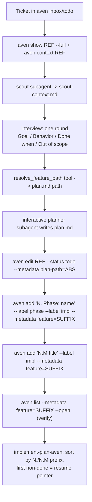

# Feature Plan (Aven)

Turn an aven ticket into a plan and an aven hierarchy a worker can execute.
The ticket already exists in aven — your job is context + interview + plan.md +
the phase/subtask tree. `implement-plan-aven` (sibling, to be written) resumes
from the result.

Workspaces: personal projects live in the aven `personal` workspace, work in
`salaryhero`. Aven infers the workspace from the cwd via its config routes —
run aven commands from the repo root; pass `--workspace <name>` only when
targeting another workspace. Verify routing with `aven doctor` if refs fail
with `unknown-ref`.

## Flow



### 1. Pickup (~30s)

`aven show <REF> --full` + `aven context <REF>`. Skim `README.md`, `AGENTS.md`,
`package.json`, and the area the feature touches — just enough to brief the
scout.

### 2. Scout

Spawn read-only scout subagent(s) — parallel is fine:

```
subagent({
  name: "scout: <area>",
  agent: "scout",
  task: "Feature context: <summary>\n\nMap the affected area: file structure, key modules, conventions, similar existing features. Focus on what a planner needs before designing this feature. Save findings to: <artifact-folder>/scout-context.md",
});
```

End your turn after spawning. Wait for the `subagent_result` steer message(s),
then read the scout context back.

### 3. Resolve the plan artifact path

Call `resolve_feature_path` with the feature summary (tool from pi-planning —
taskwarrior-agnostic, reused as-is). Use the returned absolute `plan.md` path
verbatim everywhere below — never hand-roll it.

### 4. Interview — one focused round

Ask only what you can't infer from scout findings, grouped in a single message.
Aim for 3–6 questions (behavior, scope, trigger/UX, constraints, edge cases,
boundaries). Always offer the out: "...or say 'use your judgment' and I'll pick
sensible defaults." If the user defers, pick defaults and mark them as
assumptions.

### 5. Contract on the feature ticket

Aven tickets already carry a title + description, so no task creation. Record
the interview + plan location:

```bash
# Labels must exist before use (repeat-safe: ignore "already exists" errors)
aven label create phase 2>/dev/null || true
aven label create impl 2>/dev/null || true

aven note <REF> --stdin <<'EOF'
Goal: ...
Behavior: ...
Done when: ...
Out of scope: ...
EOF

aven edit <REF> --status todo --metadata plan-path=<absolute plan.md path>
```

`<REF>` is the qualified ref (e.g. `PMR-ZTVG`); `<SUFFIX>` used below is its
suffix (`ZTVG`). Labels mark task kind (`phase`/`impl`); the `feature=<SUFFIX>`
metadata groups the tree (labels can't carry the ref, and per-feature labels
would proliferate).

### 6. Spawn the interactive planner

```
subagent({
  name: "💬 Planner: <summary>",
  agent: "planner",
  interactive: true,
  task: [
    "Plan: <request>",
    "",
    "Scout findings:",
    "<scout-context summary or path>",
    "",
    "Interview answers:",
    "<Goal/Behavior/Done when/Out of scope>",
    "",
    "Write the final plan to: <absolute plan.md path>",
    "",
    "After writing the plan file, call the open_in_pane tool with that path to open it with glow in a review pane. Skippable if the user declines or the tool is unavailable — never block on it.",
    "",
    "Aven output contract (use these exact commands):",
    "<paste the Aven output contract below>",
  ].join("\n"),
});
```

The planner runs its own methodology (requirements, approaches, premortem,
plan) with the user — don't re-specify that. Your job is context + the output
contract. Contract points:

- `feature=<SUFFIX>` metadata on EVERY phase and subtask — it is the grouping key.
- `N.` / `N.M` title prefixes are REQUIRED — the execution plan sorts by them.
- Capture each phase ref from its `aven add` output (`created PMR-XXXX`) — subtasks don't depend on it unless you want `--ready` gating.
- The planner must NOT commit code and must NOT set status beyond `todo`.

### 7. Verify the hierarchy

```bash
aven list --metadata feature=<SUFFIX> --open
```

Present the list to the user and ask them to review both `plan.md` and the
tree. Fixups go through the planner's contract commands.

### 8. Fallback — no `subagent` tool

Do the scout work in the main session (`fast_context_search` / `grep` /
`read`), write `plan.md` yourself, and create the hierarchy directly with the
identical commands from the contract below. Everything else — interview,
notes, metadata, verification — is unchanged. Call `open_in_pane` with the
plan path after writing (skippable on request; tool failure never blocks).

## Aven output contract

Byte-identical commands for both the planner and the fallback. `$SUFFIX` is
the feature ref suffix from step 5.

```bash
# Phase — ref is printed inline by aven add; capture it if subtasks gate on it
PHASE_REF=$(aven add "N. Phase: <name>" --label phase --label impl --metadata feature=$SUFFIX 2>&1 | grep -oP 'created \K\w+')

# Subtask under the phase (optional gating so --ready hides blocked work)
aven add "N.M <title>" --label impl --metadata feature=$SUFFIX
aven dep add <SUBTASK_REF> $PHASE_REF   # optional
```

Repeat per phase, incrementing `N` (`1.`, `2.`, ...); subtasks `1.1`, `1.2`,
`2.1`, ...

## What We're NOT Doing

- No taskwarrior — no UUID plumbing, no `work_state` UDA, no `jiraid`. This
  skill is the aven sibling of `feature-plan`.
- No Jira — Jira-linked work routes to `create-plan` (taskwarrior/jira flow).
- No branch automation.
- No epics for grouping — epic membership is create-time only, and tickets
  already exist by the time this flow runs.

## Integration with Other Skills

- `/skill:create-plan` — the Jira sibling; delegate there when a Jira ID exists.
- `/skill:feature-plan` — the taskwarrior sibling; use it only for legacy TW
  feature trees.
- `implement-plan-aven` (planned) — resumes this hierarchy via
  `aven list --metadata feature=<SUFFIX>`; resume pointer = first non-done
  task in N./N.M title order.
